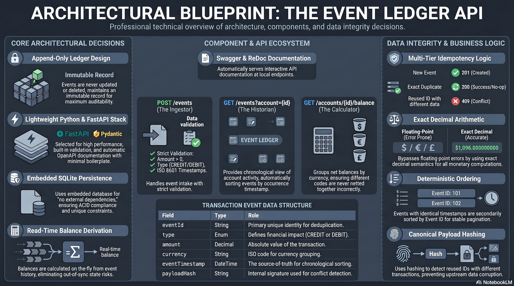
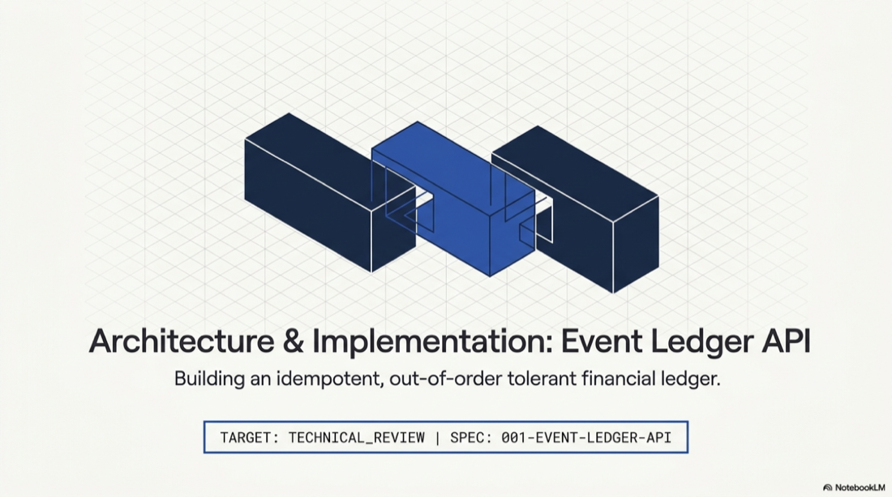

# Event Ledger API

Local API for accepting financial transaction events, handling duplicate delivery
idempotently, listing account events chronologically, and deriving account balances
from accepted unique events.

## Architecture & design

<p align="center">
  <a href="assets/event-ledger-api.png">
    
  </a>
</p>

<p align="center">
  <strong>Architectural blueprint</strong> — append-only ledger, FastAPI ingestor, read-time balances,<br />
  multi-tier idempotency (<code>201</code> / <code>200</code> / <code>409</code>), and exact decimal arithmetic.
</p>

<table align="center">
  <tr>
    <td align="center" width="280">
      <a href="assets/Idempotent_Event_Ledger_Design.pdf">
        
      </a>
      <br /><br />
      <sub><strong>Idempotent Event Ledger Design</strong><br />Full narrative — hashing, conflicts, ordering, ops</sub>
    </td>
    <td align="center" width="280">
      <a href="assets/event-ledger-api.png">
        
      </a>
      <br /><br />
      <sub><strong>One-page overview</strong><br />Components, endpoints, and integrity decisions</sub>
    </td>
    <td align="center" width="280">
      <a href="#docker">
        
      </a>
      <br /><br />
      <sub><strong>Quick start</strong><br /><code>docker compose up --build</code> → <code>/docs</code></sub>
    </td>
  </tr>
</table>

<details>
<summary><strong>What the blueprint covers</strong></summary>

| Area | Highlights |
|------|------------|
| **Core decisions** | Append-only immutable ledger · FastAPI + Pydantic · embedded SQLite · balances derived at read time |
| **API surface** | `POST /events` (ingestor) · `GET /events?account=` (historian) · `GET /accounts/{id}/balance` (calculator) |
| **Integrity** | Idempotency by `eventId` · canonical `payloadHash` for conflicts · `Decimal` money math · stable sort by timestamp then ID |

</details>

### Design document (PDF)

GitHub cannot embed PDF files directly in Markdown. The preview below is rendered from
[`assets/Idempotent_Event_Ledger_Design.pdf`](assets/Idempotent_Event_Ledger_Design.pdf)
so you can read the full design in-repo without leaving the README.

<p align="center">
  <a href="assets/Idempotent_Event_Ledger_Design.pdf" title="Open full-resolution PDF">
    
  </a>
</p>

<p align="center">
  <a href="assets/Idempotent_Event_Ledger_Design.pdf"><strong>Download full PDF</strong></a>
  &nbsp;·&nbsp;
  <sub>Regenerate preview: <code>./scripts/render-design-pdf-preview.sh</code></sub>
</p>

### Walkthrough video

GitHub cannot embed a playable YouTube player in Markdown. The preview below uses the
video thumbnail; click it to open the walkthrough on YouTube.

<p align="center">
  <a href="https://www.youtube.com/watch?v=IvFRlETjgpg" title="Watch on YouTube">
    
  </a>
</p>

<p align="center">
  <a href="https://www.youtube.com/watch?v=IvFRlETjgpg"><strong>Watch on YouTube</strong></a>
  &nbsp;·&nbsp;
  <sub><a href="https://youtu.be/IvFRlETjgpg">youtu.be/IvFRlETjgpg</a></sub>
</p>

---

## Prerequisites

- Python 3.11 or newer
- `pip`

No external database, production credentials, or external financial system access
is required. The service uses embedded SQLite (`event_ledger.db` in the working
directory).

## Install Dependencies

```bash
./scripts/bootstrap-venv.sh
source .venv/bin/activate
```

On macOS Desktop / iCloud, prefer `bootstrap-venv.sh` over a manual `pip install -e`
if installs or tests hang. The bootstrap script uses a **non-editable** install plus
`src/` on `PYTHONPATH` (via pytest config and `./scripts/run-dev.sh`).

## Start the Application

From the repo root with the virtualenv activated:

```bash
./scripts/run-dev.sh
```

Or manually (same behavior):

```bash
PYTHONPATH=src uvicorn event_ledger_api.main:app --reload --reload-dir src
```

Use `--reload-dir src` so the reloader watches application code only, not `.venv/`
(avoid reload loops right after `pip install`).

### `pip`, `pytest`, or `uvicorn` hang (no output, must Ctrl+C)

On macOS, if the repo lives under **Desktop** (iCloud Drive), files inside `.venv` can
become **dataless** placeholders. Python then blocks on every import and looks frozen.

**Fix:** recreate the virtualenv (from repo root):

```bash
./scripts/bootstrap-venv.sh
source .venv/bin/activate
pytest -q
./scripts/run-dev.sh
```

Longer-term: clone or move the project to a folder that is **not** iCloud-synced
(for example `~/Projects/schwab-event-api-ledger`). Do not rely on a `.venv` that
iCloud can offload.

### `ModuleNotFoundError: No module named 'event_ledger_api'`

`pytest` adds `src/` via `pythonpath` in `pyproject.toml`, so tests can pass even when
`uvicorn` cannot import the package.

On macOS, an editable install writes
`.venv/lib/python3.14/site-packages/_editable_impl_event_ledger_api.pth`. If that file
is marked **hidden** (common with iCloud Desktop or Finder), Python skips it and the
package is not on `sys.path`. Use `./scripts/run-dev.sh` or `PYTHONPATH=src` as above.

If you prefer a plain `uvicorn` command without `PYTHONPATH`, clear the hidden flag
after `pip install -e ".[dev]"` (adjust the Python version in the path if needed):

```bash
chflags nohidden .venv/lib/python3.14/site-packages/_editable_impl_event_ledger_api.pth
uvicorn event_ledger_api.main:app --reload --reload-dir src
```

The API listens at `http://127.0.0.1:8000`.

## Docker

Run the API in a container with persistent SQLite storage:

```bash
docker compose up --build
```

- API: [http://localhost:8000](http://localhost:8000)
- Swagger UI: [http://localhost:8000/docs](http://localhost:8000/docs)
- ReDoc: [http://localhost:8000/redoc](http://localhost:8000/redoc)

Data is stored in a Docker volume at `/data/event_ledger.db`.

## API Documentation

| Resource | URL |
|----------|-----|
| Swagger UI (interactive) | `http://127.0.0.1:8000/docs` |
| ReDoc | `http://127.0.0.1:8000/redoc` |
| OpenAPI JSON (generated) | `http://127.0.0.1:8000/openapi.json` |
| OpenAPI YAML (static contract) | `http://127.0.0.1:8000/openapi.yaml` |

The static contract is bundled at `src/event_ledger_api/contracts/openapi.yaml`
(canonical Spec Kit copy:
`project-specifications/specs/001-event-ledger-api/contracts/openapi.yaml`).

## Submit an Event

```bash
curl -s -X POST http://127.0.0.1:8000/events \
  -H 'Content-Type: application/json' \
  -d '{
    "eventId": "evt-001",
    "accountId": "acct-123",
    "type": "CREDIT",
    "amount": 150.00,
    "currency": "USD",
    "eventTimestamp": "2026-05-15T14:02:11Z",
    "metadata": {
      "source": "mainframe-batch",
      "batchId": "B-9042"
    }
  }'
```

Submitting the same event again returns the original stored event (`200`) without
creating another ledger entry or changing the balance.

## Retrieve an Event

```bash
curl -s http://127.0.0.1:8000/events/evt-001
```

## List Account Events

```bash
curl -s 'http://127.0.0.1:8000/events?account=acct-123'
```

Events are ordered by `eventTimestamp`, then `eventId`. Responses include a
`pagination` object with `total`, `limit`, `offset`, and `hasMore`.

### Pagination

Request a page with `limit` and `offset` (offset defaults to `0`):

```bash
curl -s 'http://127.0.0.1:8000/events?account=acct-123&limit=50&offset=0'
```

Omit `limit` to return the full account history in one response (`pagination.limit`
is `null` and `hasMore` is `false`).

## Get Account Balance

```bash
curl -s http://127.0.0.1:8000/accounts/acct-123/balance
```

Balances are derived from accepted unique events and grouped by currency.

## Concurrency and Idempotency

Simultaneous `POST /events` requests for the same `eventId` are safe: the database
enforces uniqueness on `eventId`, and the service recovers from concurrent inserts
by returning **200** for exact duplicates or **409** for conflicting payloads—never
a duplicate ledger row or balance drift.

## Run Tests

```bash
./scripts/pytest.sh
```

Or, with the venv activated:

```bash
pytest
```

If `pytest` sits with no output for a long time on macOS Desktop, use `./scripts/pytest.sh`
(sets `PYTHONPATH` and `--assert=plain`). With **Conda**, run `conda deactivate` first so
only `.venv` is on your `PATH`.

### Test coverage

Generate a coverage report for all tests (line + branch coverage on `event_ledger_api`):

```bash
./scripts/coverage.sh
```

This writes:

| Artifact | Purpose |
|----------|---------|
| [coverage/REPORT.md](coverage/REPORT.md) | Committed summary (percentages, per-module table, suite layout) |
| `coverage/coverage.json` | Machine-readable coverage data |
| `coverage/html/index.html` | Local HTML report (gitignored; open in a browser) |

Re-run `./scripts/coverage.sh` after changing application code or tests to refresh the report.

## Data Safety

- Uses a local SQLite file only; no external database.
- Use synthetic fixture data in tests and examples — do not commit real customer
  or production Schwab credentials.

## Specification

Design artifacts live under
`project-specifications/specs/001-event-ledger-api/` (OpenAPI contract, plan,
tasks, and data model).
